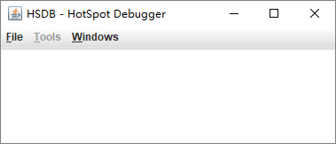
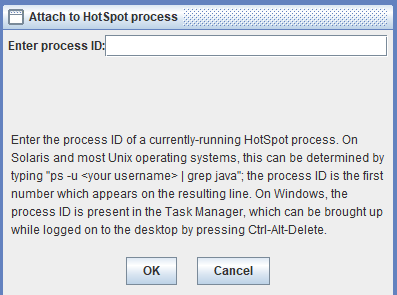
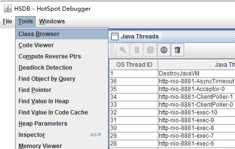
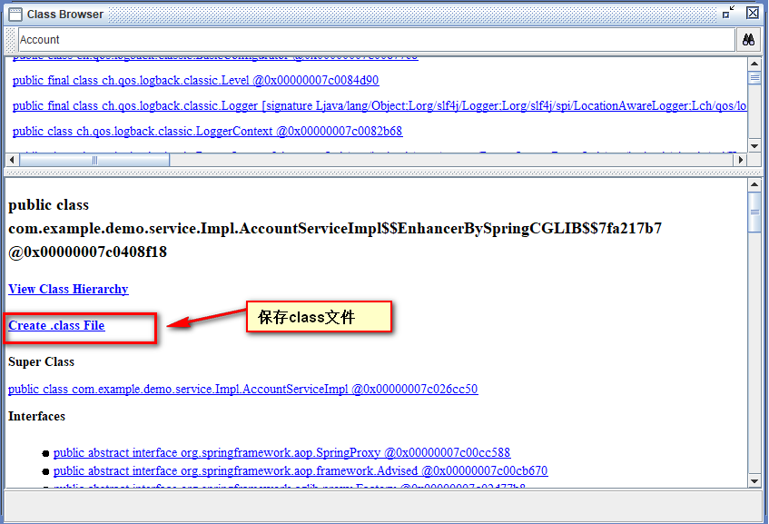

# 保存java 动态代理生成的字节码文件

在Java中，常用的动态代理技术有JDK的动态代理和cglib动态代理，不管是什么动态代理，最后都要动态的生成对应的**.class**,正常情况下，这个字节码文件并不会保存到本地，只会存在于内存之中。好奇心的驱使之下，决定以探其庐山真面目。经过查阅资料，自己觉得比较好用的两种方案，都在下面了。

### 

通过运行HSDB,可以保存任意运行中的java 项目中的字节码文件。不仅可以保存JDK动态代理的字节码文件，cglib动态代理字节码文件也可以保存。但是这种方式需要一个正在运行中的java项目才可以。

#### 1 运行cmd  ,运行命令:

如果时win10系统一定采用**cmd** ，而不要采用 **powerShell** 运行该命令，会出现找不到类清单的问题。

```
C:\Users\pc>java -classpath "%JAVA_HOME%/lib/sa-jdi.jar" sun.jvm.hotspot.HSDB
```

#### 2 执行命令后会显示如下界面





#### 3 选择file-->attach to hotspot process：





#### 4  cmd 运行 jps

```
C:\Users\pc>jps
14448 Jps
9044
19016 demo-0.0.1-SNAPSHOT.jar
7016 HSDB
16956 RemoteMavenServer
```

#### 5 在 enter process ID: 输入 19016 点击OK 按钮

#### 6  选择 Tools--> Class browser





#### 7  输入 要查找的 class 文件。

查找到文件之后点击列表 ，下方会展示class详情。如果想保存class file
 点击 Create.class File 。
 如果不出意外，class 文件已经保存好了。
 可以到执行HSDB命令的文件夹下面 查看保存的class文件。
 由于我的命令实在 C:\users\pc\目录下面执行的，所以我的文件就保存在这个目录下面。




