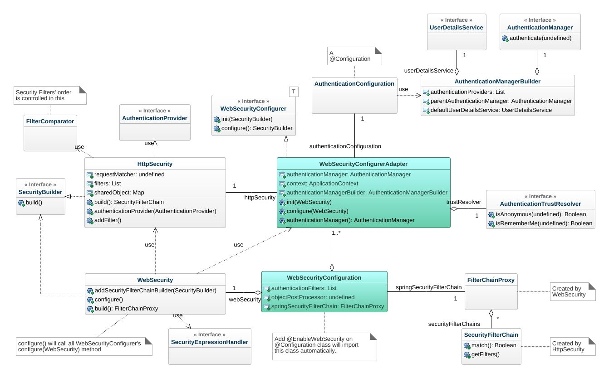
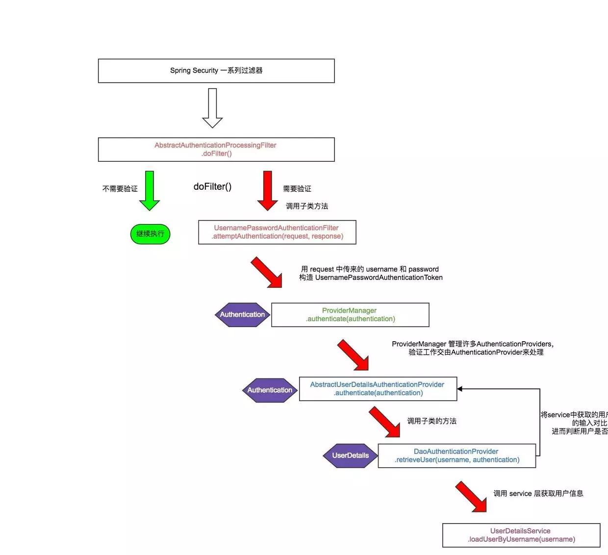
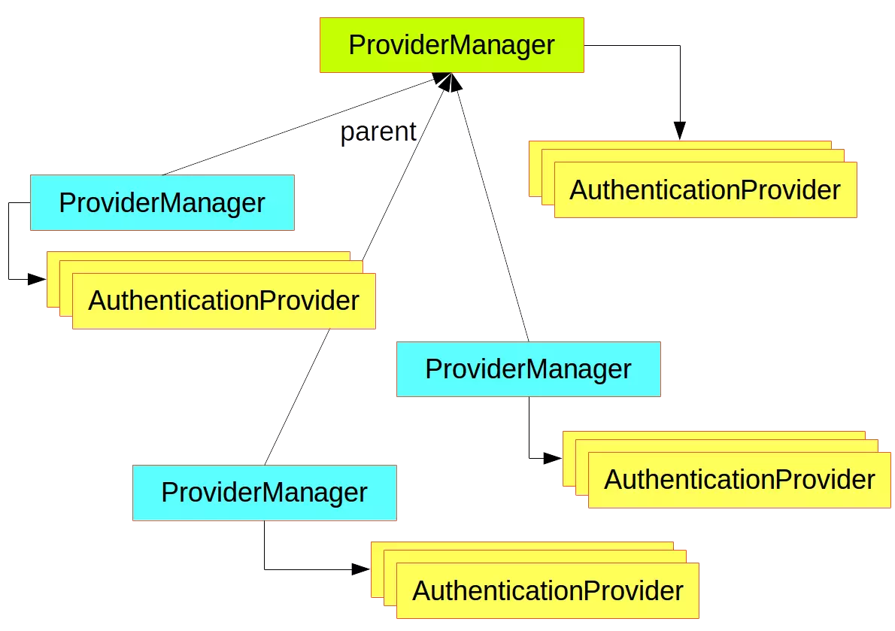
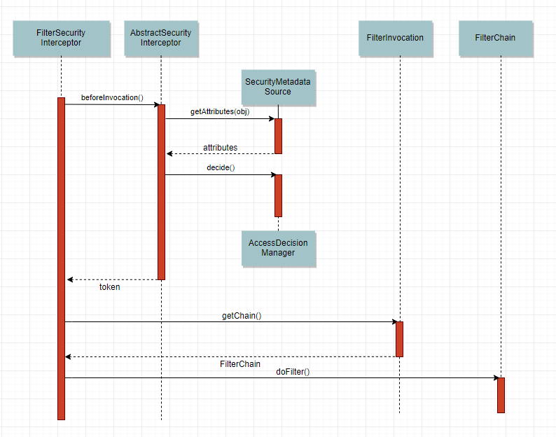

## 官方DEMO

Spring 官方的DEMO https://github.com/spring-guides/gs-securing-web/archive/master.zip

这是最最最简单的一个Security的DEMO，只实现了一个登录的功能，但是也有一定参考意义。

项目目录里一共三个类，```Application```、```MvcConfig```、```WebSecurityConfig```，分别为 SpringBoot 启动类、SpringMVC 配置类、SpringSecurity 配置类。

其中关于Security的配置类```WebSecurityConfig```如下。

```java

@Configuration
/*EnableWebSecurity注解使得SpringMVC集成了Spring Security的web安全支持。另外，WebSecurityConfig配置类同时集成了WebSecurityConfigurerAdapter，重写了其中的特定方法，用于自定义Spring Security配置。整个Spring Security的工作量。*/
@EnableWebSecurity

//**适配器模式
//继承Security配置适配器 WebSecurityConfigurerAdapter
public class WebSecurityConfig extends WebSecurityConfigurerAdapter { 
    @Override
    //重写 HttpSecurity 配置方法
    protected void configure(HttpSecurity http) throws Exception {
        http
             //定义了哪些URL路径应该被拦截，如字面意思所描述：”/“, “/home”允许所有人访问，”/login”作为登录入口，也被允许访问，而剩下的”/hello”则需要登陆后才可以访问。
            .authorizeRequests()
                .antMatchers("/", "/home").permitAll()
                .anyRequest().authenticated()
                .and()
            .formLogin()//配置表单登录
                .loginPage("/login") //登录页面地址
                .permitAll()
                .and()
            .logout()
                .permitAll();
    }

    @Bean
    @Override
    //UserDetailService 组件，这个接口其中只有一个方法 loadUserByUsername() throws UsernameNotFoundException 
    public UserDetailsService userDetailsService() {
        UserDetails user =
             User.withDefaultPasswordEncoder()
                .username("user")
                .password("password")
                .roles("USER")
                .build();

        return new InMemoryUserDetailsManager(user);//返回Security内置UserDetailsService实现，这个实现的UserDetails是存在内存中的。
    }
}

```

以上是 Security 官方简单实践。


## 核心组件



### WebSecurityConfiguration 

这个配置类存在于spring-security-config 中，这里面注册了一些重要的Bean,其中最主要的是springSecurityFilterChain。

```java
package org.springframework.security.config.annotation.web.configuration;

@Configuration
public class WebSecurityConfiguration implements ImportAware, BeanClassLoaderAware {
	private WebSecurity webSecurity;

	private Boolean debugEnabled;

	private List<SecurityConfigurer<Filter, WebSecurity>> webSecurityConfigurers;

	private ClassLoader beanClassLoader;
	
    ...
        
	/*
	 * spring security的核心过滤器，是整个认证的入口。
	 * WebSecurityConfiguration中完成了声明springSecurityFilterChain的作用，并且最终交给		 * DelegatingFilterProxy这个代理类，负责拦截请求（注意DelegatingFilterProxy这个类不是
	 * spring security包中的，而是存在于web包中，spring使用了代理模式来实现安全过滤的解耦）
	 * 这个 FilterChain 中包含了实现 Security 功能的 12 个 Filter，具体功能在下面过滤器中。
	 * 这个FilterChain内部实现使用的是责任链模式。
	 */
	@Bean(name = AbstractSecurityWebApplicationInitializer.DEFAULT_FILTER_NAME)
	public Filter springSecurityFilterChain() throws Exception {
		boolean hasConfigurers = webSecurityConfigurers != null
				&& !webSecurityConfigurers.isEmpty();
		if (!hasConfigurers) {
			WebSecurityConfigurerAdapter adapter = objectObjectPostProcessor
					.postProcess(new WebSecurityConfigurerAdapter() {
					});
			webSecurity.apply(adapter);
		}
		return webSecurity.build();
	}
    ... 
}

```


### SecurityContextHolder

`SecurityContextHolder`用于存储安全上下文（security context）的信息。当前操作的用户是谁，该用户是否已经被认证，他拥有哪些角色权限…这些都被保存在SecurityContextHolder中。`SecurityContextHolder`默认使用`ThreadLocal` 策略来存储认证信息。也就意味着，这是一种与线程绑定的策略。Spring Security在用户登录时自动绑定认证信息到当前线程，在用户退出时，自动清除当前线程的认证信息。

#### 获取当前用户的信息

因为身份信息是与线程绑定的，所以可以在程序的任何地方使用静态方法获取用户信息。一个典型的获取当前登录用户的姓名的例子如下所示：

```java
Object principal = SecurityContextHolder.getContext().getAuthentication().getPrincipal();

if (principal instanceof UserDetails) {
	String username = ((UserDetails)principal).getUsername();
} else {
	String username = principal.toString();
}
```

```getAuthentication()```返回了认证信息，再次```getPrincipal()```返回了身份信息，```UserDetails```便是Spring对身份信息封装的一个接口。```Authentication和UserDetails```的介绍在下面的小节具体讲解，本节重要的内容是介绍```SecurityContextHolder```这个容器。


###  Authentication

```java
package org.springframework.security.core;

public interface Authentication extends Principal, Serializable { 
    Collection<? extends GrantedAuthority> getAuthorities(); 

    Object getCredentials();

    Object getDetails();

    Object getPrincipal();

    boolean isAuthenticated();

    void setAuthenticated(boolean var1) throws IllegalArgumentException;
}
```

``` Authentication```是```spring security```包中的接口，直接继承自Principal类，而Principal是位于`java.security`包中的。```Authentication在spring security```中是最高级别的身份/认证的抽象。

由这个顶级接口，我们可以得到用户拥有的权限信息列表，密码，用户细节信息，用户身份信息，认证信息。

```authentication.getPrincipal()```返回了一个Object，我们将```Principal```强转成了```Spring Security```中最常用的UserDetails，这在```Spring Security```中非常常见，接口返回Object，使用```instanceof```判断类型，强转成对应的具体实现类。接口详细解读如下：

- ```getAuthorities()```，权限信息列表，默认是```GrantedAuthority```接口的一些实现类，通常是代表权限信息的一系列字符串。
- ```getCredentials()```，密码信息，用户输入的密码字符串，在认证过后通常会被移除，用于保障安全。
- ```getDetails()```，细节信息，web应用中的实现接口通常为 ```WebAuthenticationDetails```，它记录了访问者的ip地址和```sessionId```的值。
- ```getPrincipal()```，最重要的身份信息，大部分情况下返回的是```UserDetails```接口的实现类，也是框架中的常用接口之一。```UserDetails```接口将会在下面的小节重点介绍。

#### Security是如何完成身份认证的？

步骤：

1 用户名和密码被过滤器获取到，封装成`Authentication`,通常情况下是`UsernamePasswordAuthenticationToken`这个实现类。

2 `AuthenticationManager` 身份管理器负责验证这个`Authentication`

3 认证成功后，`AuthenticationManager`身份管理器返回一个被填充满了信息的（包括上面提到的权限信息，身份信息，细节信息，但密码通常会被移除）`Authentication`实例。

4 `SecurityContextHolder`安全上下文容器将第3步填充了信息的```Authentication```，通过```SecurityContextHolder.getContext().setAuthentication(…)```方法，设置到其中。


###  AuthenticationManager

```AuthenticationManager```（接口）是认证相关的核心接口，也是发起认证的出发点，因为在实际需求中，我们可能会允许用户使用用户名+密码登录，同时允许用户使用邮箱+密码，手机号码+密码登录，甚至，可能允许用户使用指纹登录，所以说```AuthenticationManager```一般不直接认证，```AuthenticationManager```接口的常用实现类`ProviderManager` 内部会维护一个`List<AuthenticationProvider>`列表，存放多种认证方式，实际上这是委托者模式的应用（Delegate）。也就是说，核心的认证入口始终只有一个：```AuthenticationManager```，不同的认证方式：用户名+密码（```UsernamePasswordAuthenticationToken```），邮箱+密码，手机号码+密码登录则对应了三个```AuthenticationProvider```。只需要通过一个```AuthenticationProvider```的认证，即可被认为是登录成功。

```ProviderManager``` 中的List，会依照次序去认证，认证成功则立即返回，若认证失败则返回null，下一个```AuthenticationProvider```会继续尝试认证，如果所有认证器都无法认证成功，则```ProviderManager``` 会抛出一个```ProviderNotFoundException```异常。


### DaoAuthenticationProvider

```AuthenticationProvider``` 最常用的一个实现是 ```DaoAuthenticationProvider```。

用户前台提交了用户名和密码，而数据库中保存了用户名和密码，认证便是负责比对同一个用户名，提交的密码和保存的密码是否相同便是了。在Spring Security中。提交的用户名和密码，被封装成了```UsernamePasswordAuthenticationToken```，而根据用户名加载用户的任务则是交给了```UserDetailsService```，在```DaoAuthenticationProvider```中，对应的方法便是```retrieveUser()```，虽然有两个参数，但是retrieveUser只有第一个参数起主要作用，返回一个```UserDetails```。还需要完成```UsernamePasswordAuthenticationToken```和```UserDetails```密码的比对，这便是交给```additionalAuthenticationChecks```方法完成的，如果这个void方法没有抛异常，则认为比对成功。比对密码的过程，用到了```PasswordEncoder```和```SaltSource```，密码加密和盐的概念相信不用我赘述了，它们为保障安全而设计，都是比较基础的概念。

```DaoAuthenticationProvider```：它获取用户提交的用户名和密码，比对其正确性，如果正确，返回一个数据库中的用户信息（假设用户信息被保存在数据库中）。

### UserDetails与UserDetailsService

上面不断提到了UserDetails这个接口，它代表了最详细的用户信息，这个接口涵盖了一些必要的用户信息字段，具体的实现类对它进行了扩展。

```java
public interface UserDetails extends Serializable {

   Collection<? extends GrantedAuthority> getAuthorities();

   String getPassword();

   String getUsername();

   boolean isAccountNonExpired();

   boolean isAccountNonLocked();

   boolean isCredentialsNonExpired();

   boolean isEnabled();
}
```

和```Authentication```接口很类似，它们都拥有```username```，```authorities```。```Authentication```的```getCredentials()```与```UserDetails```中的```getPassword()```需要被区分对待，前者是用户提交的密码凭证，后者是用户正确的密码，认证器其实就是对这两者的比对。```Authentication```中的```getAuthorities()```实际是由UserDetails的getAuthorities()传递而形成的。```Authentication```接口中的```getUserDetails()```，便是经过了```AuthenticationProvider```之后被填充的。

```java
public interface UserDetailsService {
   UserDetails loadUserByUsername(String username) throws UsernameNotFoundException;
}
```

***UserDetailsService只负责从特定的地方（通常是数据库）加载用户信息***。```UserDetailsService```常见的实现类有JdbcDaoImpl，```InMemoryUserDetailsManager```（之前官方DEMO中虽然没有显式注册这个Bean，但实际上用的也是这个```InMemoryUserDetailsManager```实现），前者从数据库加载用户，后者从内存中加载用户，也可以自己实现```UserDetailsService```。


## 过滤器
两个至关重要的类：```OncePerRequestFilter```和```GenericFilterBean```，在过滤器链的过滤器中，或多或少间接或直接继承他们。

```OncePerRequestFilter```顾名思义，能够确保在一次请求只通过一次filter，而不需要重复执行。
```GenericFilterBean```是javax.servlet.Filter接口的一个基本的实现类 

```GenericFilterBean```不依赖于Spring的```ApplicationContext```，Filters通常不会直接读取他们的容器信息（```ApplicationContext concept```）而是通过访问spring容器（Spring root application context）中的service beans来获取，通常是通过调用filter里面的```getServletContext()``` 方法来获取

###1.WebAsyncManagerIntegrationFilter

根据请求封装获取```WebAsyncManager```
从```WebAsyncManager```获取/注册 ```SecurityContextCallableProcessingInterceptor```

### 2.SecurityContextPersistenceFilter

先实例```SecurityContextHolder -> HttpSessionSecurityContextRepository```.

作用：其会从Session中取出已认证用户的信息,提高效率,避免每一次请求都要查询用户认证信息。
根据请求和响应构建```HttpRequestResponseHolder```
repo根据```HttpRequestResponseHolder```加载```context```获取```SecurityContext```
SecurityContextHolder将获得到的```SecurityContext```设置到```Context```中，然后继续向下执行其他过滤器
```finally-> SecurityContextHolder```获取```SecurityContext```，然后清除，并将其和请求信息保存到repo，从请求中移除FILTER_APPLIED属性

### 3.HeaderWriterFilter

往该请求的```Header```中添加相应的信息,在http标签内部使用```security:headers```来控制

### 4.CsrfFilter

csrf 又称跨域请求伪造，攻击方通过伪造用户请求访问受信任站点。
对需要验证的请求验证是否包含csrf的token信息，如果不包含，则报错。这样攻击网站无法获取到token信息，则跨域提交的信息都无法通过过滤器的校验。

### 5.LogoutFilter

匹配URL,默认为```/logout```
匹配成功后则用户退出,清除认证信息

### 6.RequestCacheAwareFilter

通过```HttpSessionRequestCache```内部维护了一个```RequestCache```，用于缓存```HttpServletRequest```

### 7.SecurityContextHolderAwareRequestFilter

针对```ServletRequest```进行了一次包装，使得request具有更加丰富的API

### 8.AnonymousAuthenticationFilter

当```SecurityContextHolder```中认证信息为空,则会创建一个匿名用户存入到```SecurityContextHolder```中。匿名身份过滤器，与 ```UsernamePasswordAuthenticationFilter``` 放在一起，```spring security```为了兼容未登录的访问，也走了一套认证流程，只不过是一个匿名的身份。

### 9.SessionManagementFilter

```securityContextRepository```限制同一用户开启多个会话的数量
```SessionAuthenticationStrategy```防止```session-fixation protection attack```（保护非匿名用户）

### 10.ExceptionTranslationFilter

```ExceptionTranslationFilter```异常转换过滤器位于整个```springSecurityFilterChain```的后方，用来转换整个链路中出现的异常
此过滤器的作用是处理中```FilterSecurityInterceptor```抛出的异常，然后将请求重定向到对应页面，或返回对应的响应错误代码

### 11. ** FilterSecurityInterceptor **

获取到所配置资源访问的授权信息
根据```SecurityContextHolder```中存储的用户信息来决定其是否有权限

### 12. ** UsernamePasswordAuthenticationFilter**

表单认证是最常用的一个认证方式，一个最直观的业务场景便是允许用户在表单中输入用户名和密码进行登录，而这背后的 ```UsernamePasswordAuthenticationFilter```，在整个Spring Security的认证体系中则扮演着至关重要的角色


## 登录（身份认证）

登录或者叫身份认证都是由 ```UsernamePasswordAuthenticationFilter``` 或者 ```AbstractAuthenticationProcessingFilter``` 的子类来实现的，我们可以根据业务需要来重新实现。

```UsernamePasswordAuthenticationFilter``` 提供了一种最常用的用户名密码表单登录的形式。




其父类``` AbstractAuthenticationProcessingFilter``` 内部有两个默认Handler——```AuthenticationSuccessHandler```、```AuthenticationFailureHandler```。我们可以重新实现这两个 ```Handler``` 以适应业务需要。




另外，上面提到可以通过自定义一个继承```AbstractAuthenticationProcessingFilter``` 的类来重新实现身份认证逻辑，由于其内部使用了***委托模式***，使用```ProviderManager```来管理多个 ```provider```，不同的```provider```提供了不同的认证形式，默认只需要通过一个 ```provider``` 的认证，即可通过身份认证。其中的```provider```就是我们可以修改或者重新实现的内容。


总结下，身份认证自定义的实现方式就是，重新实现```AbstractAuthenticationProcessingFilter ```（```security```默认的实现是```UsernamePasswordAuthenticationFilter``` ，或在```UsernamePasswordAuthenticationFilter``` 的基础上进行自定义```Handler```、```Provider```）。


## 权限鉴定

鉴权的部分是由```FilterSecurityInterceptor```这个拦截器来实现的。

这个类中使用到了两个重要的对象—— ```FilterInvocationSecurityMetadataSource``` 对象和 ```AccessDecisionManager```对象。

执行流程如下：




```FilterChain```执行到```FilterSecurityInterceptor```时，```FilterSecurityInterceptor```会执行父类 ```AbstractSecurityInterceptor``` 的```beforeInvacation()```方法。

这个方法先执行```FilterInvocationSecurityMetadataSource``` 对象的 ```getAttributes()``` 方法，获取本次请求所需要的所有 ```Attributes```（一般是角色）。

然后执行```AccessDecisionManager```对象的```decide()``` 方法，这个方法的其中一个参数就是刚拿到的```Attributes```（类型是```Collection<Attribute>```），```decide()``` 方法会根据当前用户拥有的角色、当前请求所需要的所有角色进行决策（决策逻辑根据业务需要进行定制）。若决策器```AccessDecisionManager```拒绝此请求会抛出一个AccessDeniedException异常，这个异常会被```FilterSecurityInterceptor```捕获，并进行发布（执行publishEvent()方法）。如果该请求通过决策器```AccessDecisionManager```的决策，```decide()``` 方法会return，然后FilterSecurityInterceptor会调用过滤链```filterChain```的 ```dofilter()``` 方法。

